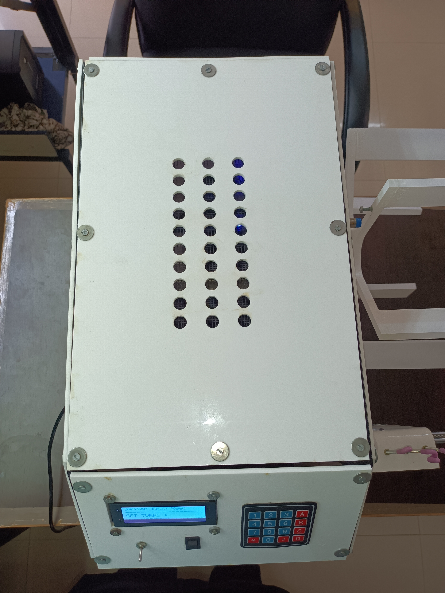

# Denier Wrap Reel Machine for Thin Strands (Yarn) with Speed Control [Version 1.0]
---
**Denier Wrap Reel**: This three-lea Automatic Wrap Reel is used to prepare lea or check the denier or count of yarn.  The purpose of this yarn testing instrument is to precisely count and test the strength of different types of yarn and fibers. The final count or denier of the yarn sample or specimen is provided with an exact and flawless outcome.

**Features of Denier Wrap Reel:**
-   The machine consists of solidly constructed wheel.
-   It has traverse mechanism.
-   Wrap reel is fitted with a 16x2 lcd.
-   It is powered by a stepper motor.
-   It has a speed control knob to control wheel speed.

**Components**
-  Mild steel makes up the basic structure, while acrylic sheets make up the enclosure.
-  Arduino Mega 2560 is utilized as main control board.
-  The output is shown on a 16x2 LCD.
-  Wheel and traverse mechanisms make use of stepper motors and stepper drivers.
-  IR sensor is used to count revolutions.
---
### Images

# Denier Wrap Reel Machine for Thin Strands (Yarn) with Speed Control [Version 2.0]
---
**Features of Denier Wrap Reel version 2:**
-   The machine consists of solidly constructed wheel.
-   It has more precise traverse mechanism.
-   Wrap reel is fitted with a 20x4 lcd.
-   It is powered by a high torque stepper motor.
-   Data of measurement is provide on web server.

**Components**
-  Mild steel makes up the basic structure, while acrylic sheets make up the enclosure.
-  Esp32 is utilized as main control board.
-  The output is shown on a 20x4 LCD.
-  Wheel and traverse mechanisms make use of stepper motors and TMC2226 stepper drivers.
-  Proximity sensor is used to count revolutions.
---
### Images

